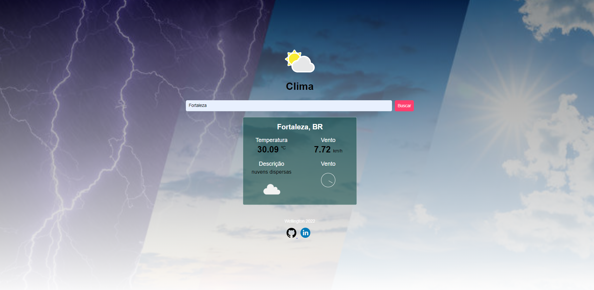

# climate-project

   <h1>Projeto Clima</h1>

 

Consumo de API do site OpenWeather para exibir o clima de uma cidade e sentido e velocidade do vento.

O objetivo é o consumo da API, e exibir as informações na tela da cidade digitada pelo usuário.
Feito apenas uma validação básica que caso você digite dá um alert pela falta de informação.

  

 

 

    <a href="https://wellington197.github.io/climate-project/" height="95px" width="440px">LINK PARA EXECUTAR PROJETO
    </a>

 

<h1>Tela inicial</h1>
  

### Conceitos aplicados no projeto
- Cosumo de API;
- Autenticação da API via JavaScript;
- Aplicação de conceitos em FLEXBOX e Grid;
- Estilização em HTML5 e CSS3;
- Subindo projeto para GitHub;
- Efetuando o build e deploy via github actions;

### Atividades realizadas 
- [X] Criação da página inicial
- [X] Estilização via CSS3 com Flexbox e Grid
- [X] Aplicação de posicionamento dos elementos
- [X] Criação das funções em javascript;
- [X] Criação de função de alerta e limpeza no formulário;
- [X] Cadastro no site para análise da API;
- [X] Conexão e autenticação com API do site https://openweathermap.org/api;
- [X] Exibição das informações na página HTML;
- [X] Testes e estilização das inforções;
- [X] Criação de repositório no GitHub
- [X] Edição de um projeto
- [X] Criação e edição do Readme
- [X] Finalização do projeto

## O que a plataforma é capaz de fazer :checkered_flag:
:trophy: Consumo de informações via API 
:trophy: Recebimento de dados via formulário pelo usuário 
:trophy: Manipulação de dados e retorno ao usuário 
:trophy: Plataforma criada com conceito de responsividade. 
:trophy: Criação e adição de repositório no GitHub 
:trophy: Criação e edição do Readme 

## Como está andamento do projeto.

> Status do Projeto: Concluido :heavy_check_mark: 
> Status do Projeto: Em desenvolvimento :heavy_check_mark:

## Linguagens e libs utilizadas :books:
    * LINGUAGENS
        - JAVASCRIPT
        - API
        - HTML5
        - CSS3

    * METODOLOGIA
        - Flexbox e Grid
        - RESPONSIVIDADE
        - 

    * FERRAMENTAS
        - GitHub
        - GitPages
        - Visual Stúdio

## Mentoria e Colaboração:

[<h5>Mentoria</h5>    Bonieki Lacerda](https://github.com/bonieky) |[<h5>Dev</h5>     Francisco Wellington Costa ](https://github.com/wellington197) |
| :---: | :---: | 
